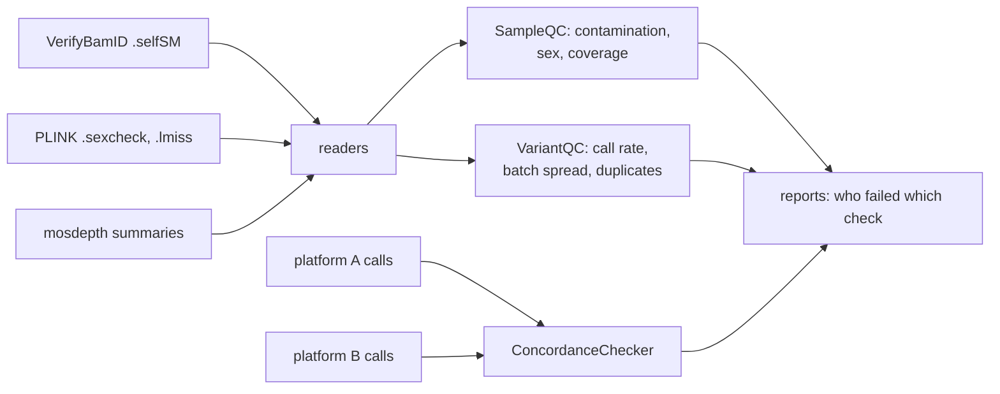

# Genomic QC Toolkit

[](https://github.com/dsugurtuna/genomic-qc-toolkit/actions/workflows/ci.yml)

Apply sample and variant QC thresholds to metrics from VerifyBamID, PLINK and mosdepth, and check genotype concordance between two platforms.

> **Portfolio project.** Demonstrates generalised genomic QC workflows. No real participant data is included.

## The problem

Before sequencing or array data are released, every sample needs the same questions answered: is it contaminated, does its genetic sex match the record, is coverage adequate, and does it match the same person on another platform? The metrics come from different tools in different formats, and the pass/fail decision is often made by hand.

## What this does

- **Reads tool outputs**: VerifyBamID `.selfSM` (FREEMIX), PLINK `--check-sex` `.sexcheck` (reported sex and X-chromosome F), mosdepth summaries (whole-genome mean depth) and PLINK `.lmiss` (variant call rate).
- **Sample QC**: contamination above a threshold (default 5%), sex mismatch (male F < 0.8 or female F > 0.2, PLINK's defaults) and coverage below a threshold (default 20x).
- **Variant QC**: call rate, a batch-effect screen (call rates that differ between batches by more than a set amount) and duplicate positions (`chr1:100` and `1:100` treated as the same).
- **Concordance**: compares genotypes for samples on both platforms as unordered allele pairs, flags samples below a concordance threshold (possible swaps) and lists samples with too few shared calls to judge.

It applies thresholds to metrics computed elsewhere; it does not compute contamination, F or coverage itself.

## Quickstart

Runs on the synthetic tool outputs in [`examples/`](examples/README.md).

```bash
git clone https://github.com/dsugurtuna/genomic-qc-toolkit.git
cd genomic-qc-toolkit
python3.11 -m venv .venv && source .venv/bin/activate
pip install -e ".[dev]"
pytest
python examples/sample_qc_demo.py
```

```text
contamination > 5%: ['SYN03']
sex mismatch:       ['SYN06']
coverage < 20x:     ['SYN08']
passed 5 of 8
```

Concordance between two platforms:

```python
from genomic_qc import ConcordanceChecker

array = {"S1": {"rs1": "AG", "rs2": "CC", "rs3": "TT"}}
wgs = {"S1": {"rs1": "G/A", "rs2": "CC", "rs3": "./."}}
report = ConcordanceChecker(min_overlap=2).check(array, wgs)
print(report.concordance_rate, report.missing, report.flagged_samples)
# 1.0 1 []
```

## How it works



## Design decisions

- **Separate reading from deciding.** Readers turn each tool's file into a plain dict; the checks only apply thresholds. Either side can change without the other, and the checks are tested without any files.
- **Genotypes are unordered allele pairs.** `AG`, `G/A` and `A|G` are the same genotype; comparing strings would report false discordance.
- **`0/0` is not missing.** In VCF it means homozygous reference; only explicit missing codes (`./.`, `--`, `0 0`, `NA`) count as missing.
- **"Not enough data" is its own outcome.** A sample with too few shared calls is listed, not quietly treated as concordant.
- **PLINK's own sex-check thresholds** (F >= 0.8 male, <= 0.2 female) are the defaults, so results line up with what PLINK prints.
- **No third-party dependencies.**

## Limitations and what it is not

- It does not compute any metric; run VerifyBamID, PLINK and mosdepth first.
- The batch-effect check is a range of call rates, not a statistical test (for example, a test of association between batch and genotype).
- Concordance does not resolve strand: an array reporting the minus strand will look discordant against sequencing on the plus strand. Align strands first.
- Samples with unknown reported sex are not failed by the sex check.

## Where this fits

Used before release alongside [gwas-data-preparation](https://github.com/dsugurtuna/gwas-data-preparation) (array QC from PLINK reports) and [vcf-plink-converter](https://github.com/dsugurtuna/vcf-plink-converter). Downstream, [biobank-data-release-manager](https://github.com/dsugurtuna/biobank-data-release-manager) covers release.

## Roadmap

- Test batch effects statistically rather than by range.
- Strand-aware concordance for A/C/G/T genotypes.
- One combined per-sample QC table as CSV.

## Jira provenance

| Ticket | Description |
| :--- | :--- |
| BIOIN-684 | End-to-end QC pipeline for genotyping array and WGS/WES data |

## Licence

MIT is declared in `pyproject.toml`, but no licence file is included yet.

---

Personal project by [Ugur Tuna](https://github.com/dsugurtuna). Not affiliated with or endorsed by any employer.
